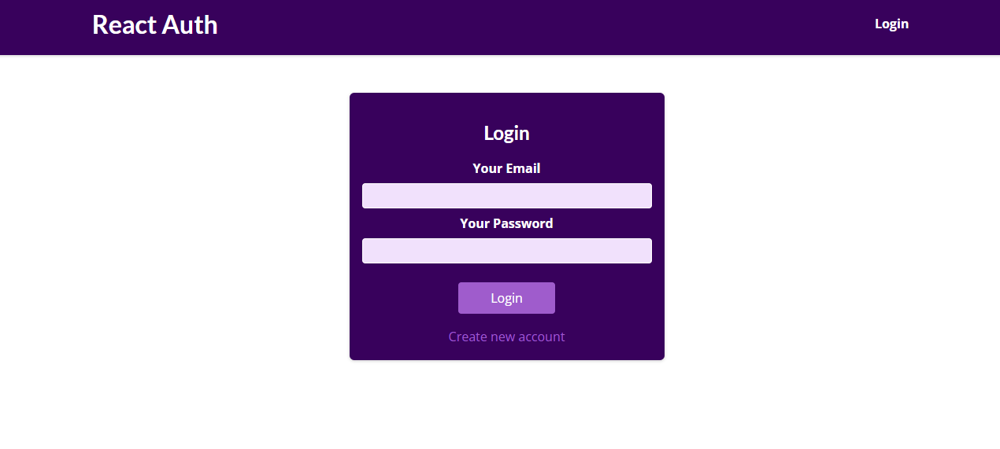
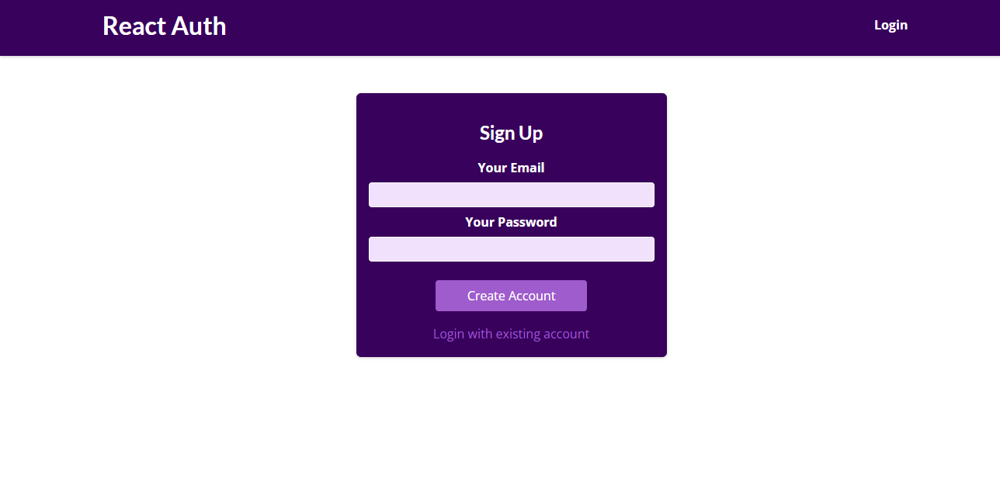
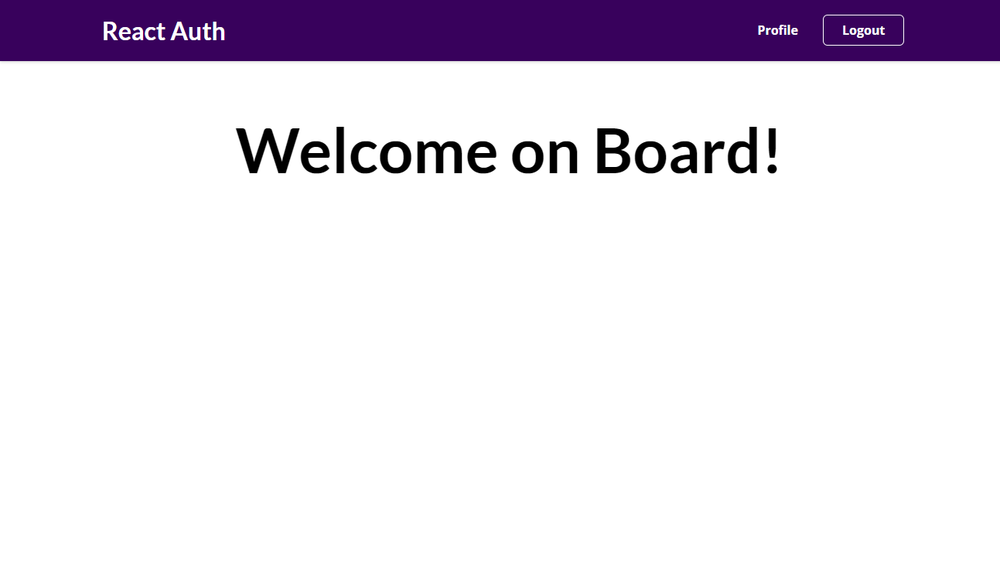
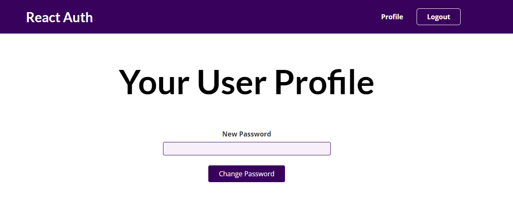
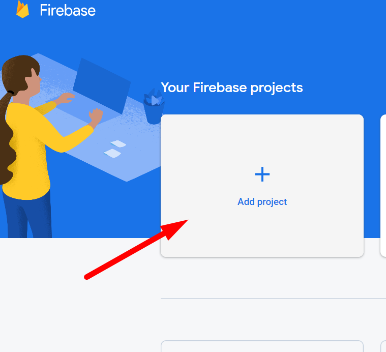
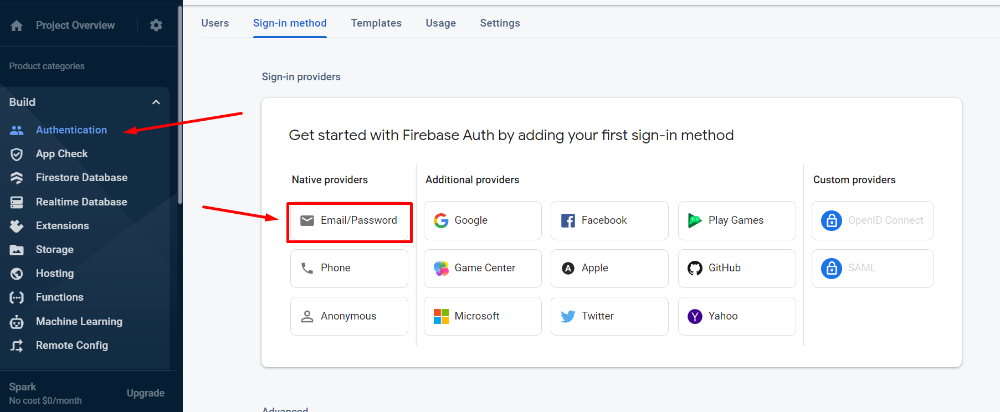
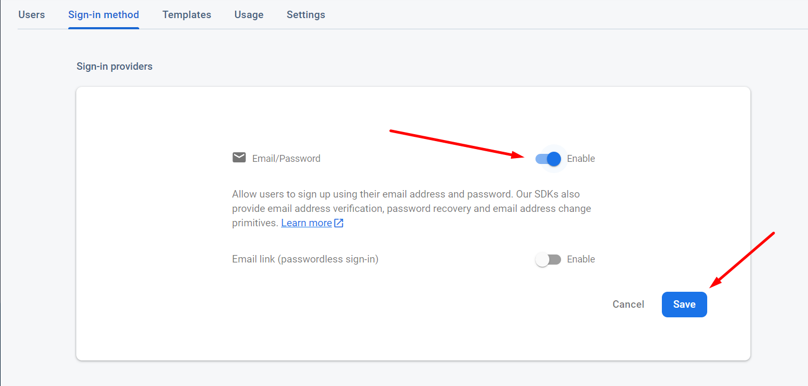
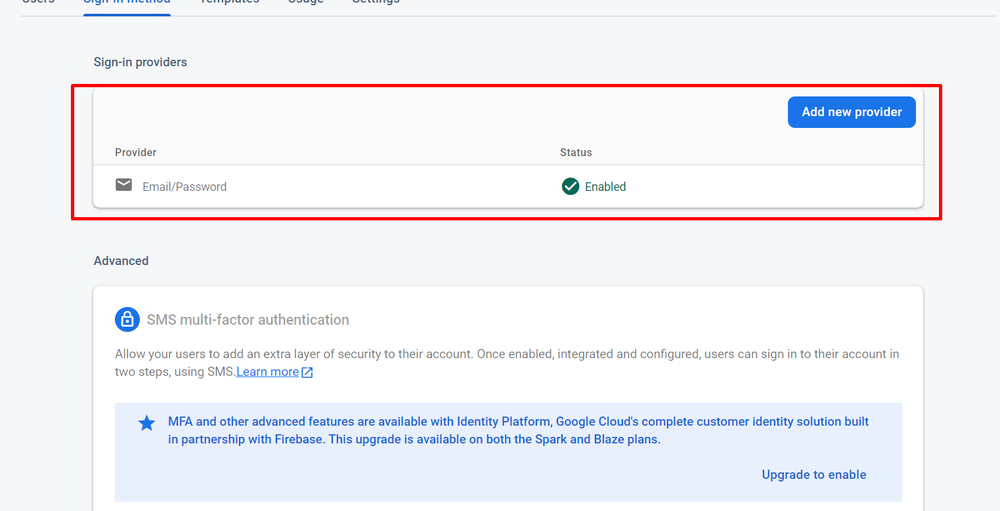
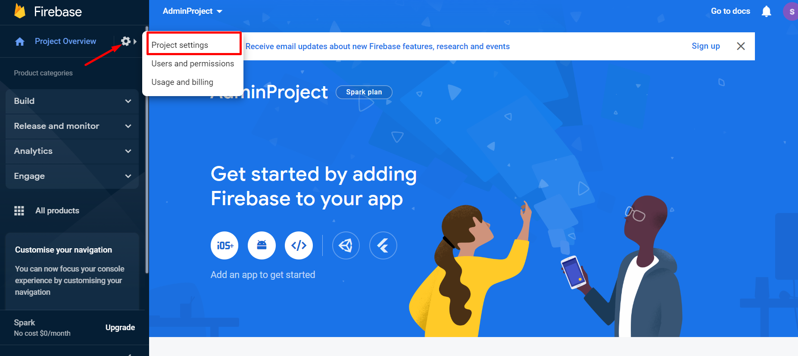
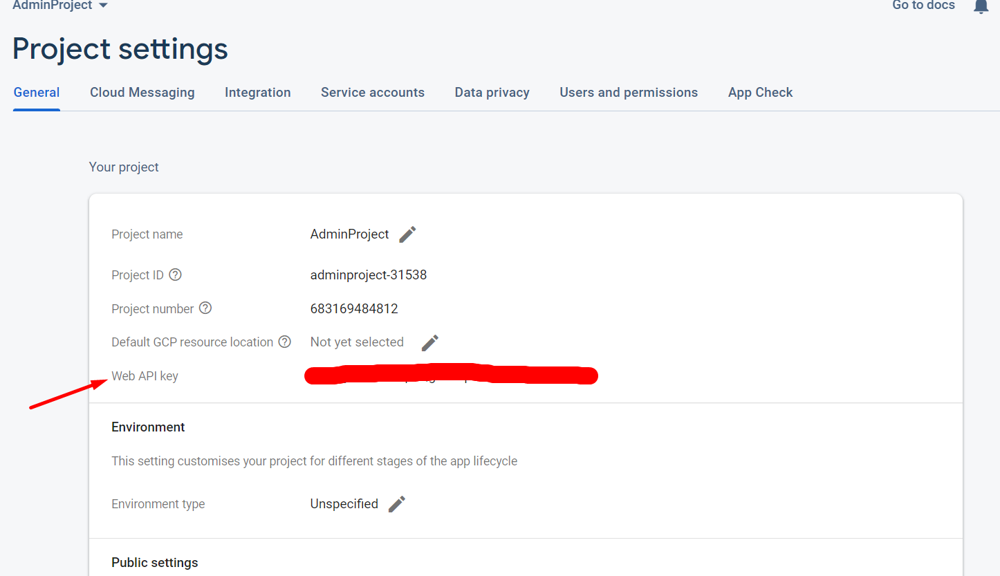

# Admin App Assignment

in this assignment you will build an app which be the final app for React course with GSD

## Details:
1. this app will have a login page as shown below 

2. when user click on create new account the same page will be exist and the labels will change as bellow

3. the nav bar as shown above will contain one tab named login, if the user make a login a new tab named profile will be shown and the login should be changed to logout as shown bellow 

4. the profile tab will contain a new form that make the user to change the password of the logged in user

 

## API Specs 

the api that will be used is [Google Firebase](https://console.firebase.google.com/) 

1. first step, create a user or sign in with your google account 

2. create a new project

3. enable signin passwrod and email 

4. how to use the api will
    - [sign in docs](https://firebase.google.com/docs/reference/rest/auth?hl=en&authuser=0#section-sign-in-email-password)
    - [sign up docs](https://firebase.google.com/docs/reference/rest/auth?hl=en&authuser=0#section-create-email-password)
    - [reset password docs](https://firebase.google.com/docs/reference/rest/auth?hl=en&authuser=0#section-change-password)

5. for all api you should provide the `API_KEY` you can find this key as follow:

